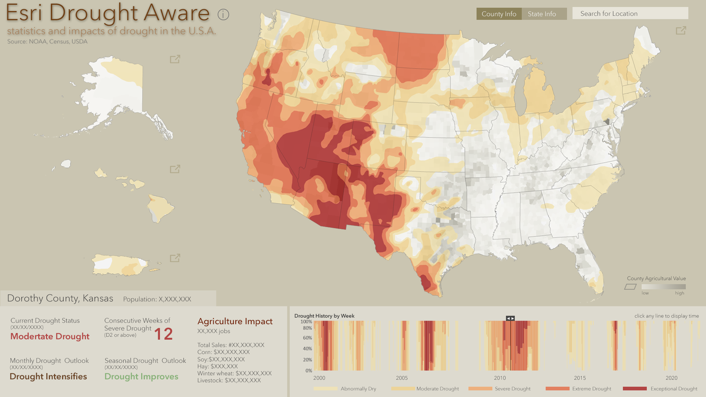

# Air Quality Aware App

The Air Quality Aware app is intended to provide information about the current conditions of air quality in the United States, along with the potential human health impacts. 

[View it live](https://livingatlas.arcgis.com/drought/)

## Features
The Drought Aware app is intended to provide the latest information about current, future and historical drought conditions in the United States. The data shown here from ArcGIS Living Atlas are authoritative U.S. government sources

Click a location in the U.S. to see the current Drought Monitor information and potential impacts. These values can be viewed by county or state from the selector at the top right.  Expanding either the Contiguous or inset maps will allow you to zoom into areas.

## Requirements

- [ArcGIS API for JavaScript (version 4.17)](https://developers.arcgis.com/javascript/index.html)
- [D3.js](https://d3js.org/)
- [React.js](https://reactjs.org/)

## Resources
- NOAA NIDIS [US Drought Monitor](https://www.airnow.gov/) and NOAA Climate Prediction Cetner Monthly and Seasonal Drought Outlooks.
- The USDA [2017 Census of Agriculture](https://www.arcgis.com/home/item.html?id=47ed83c3b4f943118e848fbfc33d119e) for agricultural values and employment.
- U.S. Census [American Community Survey](https://livingatlas.arcgis.com/en/browse/#d=2&q=ACS&cont=true) for state and county population totals for the past year.

## Issues

Find a bug or want to request a new feature?  Please let us know by submitting an issue.

## Contributing

Esri welcomes contributions from anyone and everyone. Please see our [guidelines for contributing](https://github.com/esri/contributing).